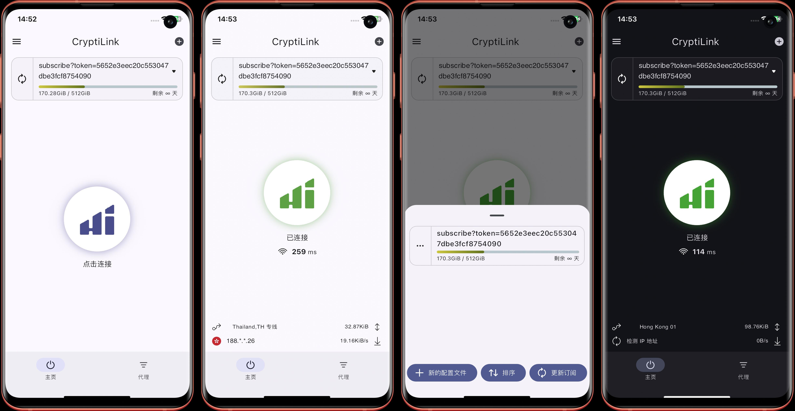

# CryptiLink
CryptiLink, A multi-platform proxy client based on Sing-box universal proxy tool-chain. Hiddify offers a wide range of capabilities, like automatic node selection, TUN mode, remote profiles etc. Hiddify is ad-free and open-source. With support for a wide range of protocols, it provides a secure and private way for accessing free internet.

